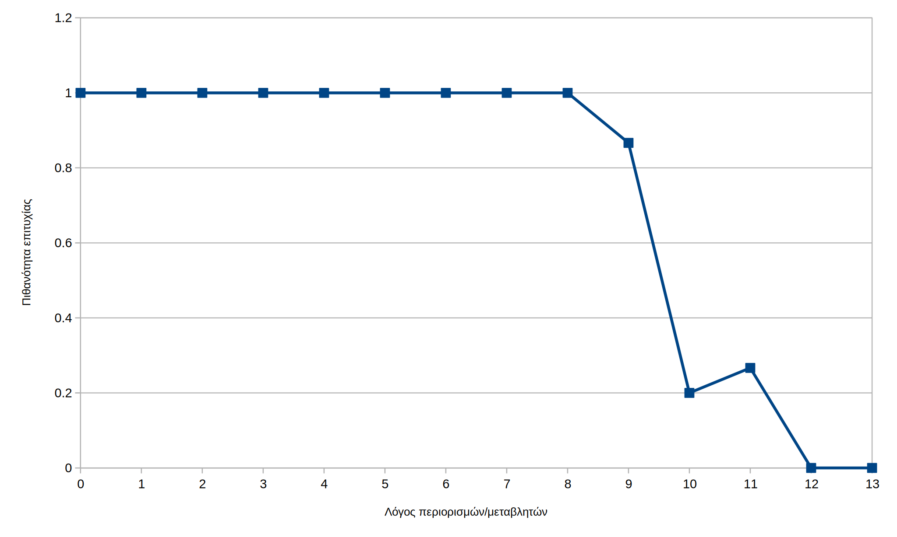
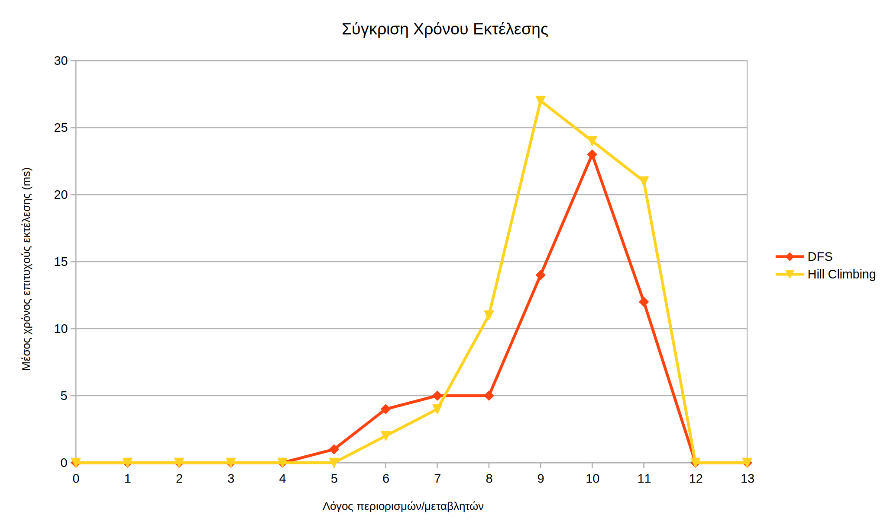

# Τεχνητή Νοημοσύνη - Εργασία 2

### Τσιρπάνης Θεόδωρος - `dai19090`

## Ζητούμενο Α

Επιλέγουμε K = __4__ όροι ανά διάζευξη.

### Η εκτέλεση της προσομοίωσης

Γράφτηκε πρόγραμμα σε C# που δημιουργεί τυχαία προβλήματα, τα λύνει με τους αλγορίθμους πρώτα σε βάθος και αναρρίχησης λόφων, μετράει τον χρόνο επίλυσης, επαληθεύει τις λύσεις, και γράφει στατιστικά για τις εκτελέσεις σε ένα αρχείο CSV. Τιμές όπως το `k`, το `m`, οι λόγοι του `m/n` που θα εξεταστούν, καθώς και ο αριθμός τυχαίων προβλημάτων ανά μέγεθος μπορούν να ρυθμιστούν από την γραμμή εντολών. Τα αρχεία των προβλημάτων και οι λύσεις τους είναι προσωρινά και διαγράφονται στο τέλος.

Ο κώδικας του προγράμματος επισυνάπτεται με την εργασία. Δεν είναι απαραίτητη η εκτέλεσή του, αλλά όπως και με την πρώτη εργασία μπορεί να εκτελεστεί εγκαθιστώντας το πακέτο ανάπτυξης λογισμικού του .NET 5 που μπορεί να ληφθεί από το https://dotnet.microsoft.com/download. Επίσης απαιτείται στον ίδιο φάκελο να βρίσκονται τα προγράμματα `bcsp.exe` και `bcsp_validate.exe`. Το `bcsp_generate.exe` δεν χρησιμοποιείται. Ισχύει timeout διάρκειας ενός λεπτού το οποίο επιβάλλεται από τον λύτη.

Το πρόγραμμα κάνει χρήση τεχνικών ασύγχρονου προγραμματισμού για την ταυτόχρονη επίλυση πολλών προγραμμάτων, σεβόμενο τον αριθμό των πυρήνων του επεξεργαστή. Ο χρόνος εκτέλεσης προκύπτει διαβάζοντας την τυπική έξοδο (`stdout`) του λύτη. Για την εκτέλεση και διαχείριση των διεργασιών χρησιμοποιείται η βιβλιοθήκη [MedallionShell](https://github.com/madelson/MedallionShell), ενώ για την εξαγωγή του χρόνου εκτέλεσης χρησιμοποιείται η ενσωματωμένη βιβλιοθήκη κανονικών εκφράσεων του .NET.

Δημιουργήθηκαν συνολικά 210 τυχαία προβλήματα με N = __20__ μεταβλητές, και M = 1, 20, 40, 60, 80, 100, 120, 140, 160, 180, 200, 220, 240, 260 περιορισμούς (δεκαπέντε προβλήματα ανά πλήθος περιορισμών). Το καθένα εκτελέστηκε και με τους δύο αλγορίθμους, φέρνοντας τον συνολικό αριθμό εκτελέσεων του λύτη στις 420. Η εντολή που εκτελέστηκε είναι η:

```
run.bat -k 4 -n 20 --trials 15 --ratios 13
```

### Αποτελέσματα

|`m/n`|Πιθανότητα Επιτυχίας|Μέσος Χρόνος Εκτέλεσης Αλγορίθμου DFS (ms)|Μέσος Χρόνος Εκτέλεσης Αλγορίθμου Hill Climbing (ms)|
|-|-|-|-|
|0|1|0|0|
|1|1|0|0|
|2|1|0|0|
|3|1|0|0|
|4|1|0|0|
|5|1|1|0|
|6|1|4|2|
|7|1|5|4|
|8|1|5|11|
|9|0.86|14|27|
|10|0.2|23|24|
|11|0.26|12|21|
|12|0|0|0|
|13|0|0|0|




### Συμπεράσματα

* Για k = 4, η πιθανότητα ένα τυχαίο πρόβλημα να λύνεται πλησιάζει το 50-50 όταν οι περιορισμοί είναι περίπου **εννιά με δέκα** φορές περισσότεροι από τις μεταβλητές. Όταν είναι κάτω από οκτώ φορές λιγότεροι, τα προβλήματα λύνονται σχεδόν με βεβαιότητα.

* Δεν είναι ξεκάθαρο ποιος αλγόριθμος είναι ο πιο αποτελεσματικός στη γενική περίπτωση. Για μικρές εισόδους ο αλγόριθμος Hill Climbing φαίνεται να κυριαρχεί του DFS, ενώ όταν το πλήθος των περιορισμών ξεπερνά τις εφτά φορές περισσότερο του πλήθους των μεταβλητών, το προβάδισμα το αποκτά ο DFS. Σε μεγάλες εισόδους βέβαια και οι δυο αλγόριθμοι φαίνεται να λειτουργούν σε μηδενικό χρόνο, επειδή έφτασαν το χρονικό όριο, και το πρόγραμμα εξάγει τον μέσο χρόνο _επιτυχούς_ εκτέλεσης.

## Ζητούμενο Β

_το Ζητούμενο Β δεν υποβάλλεται_
