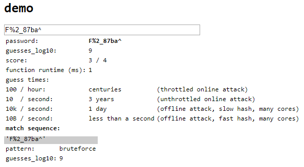
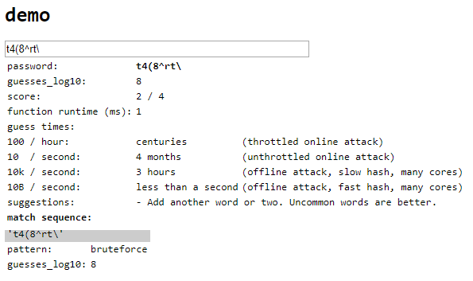
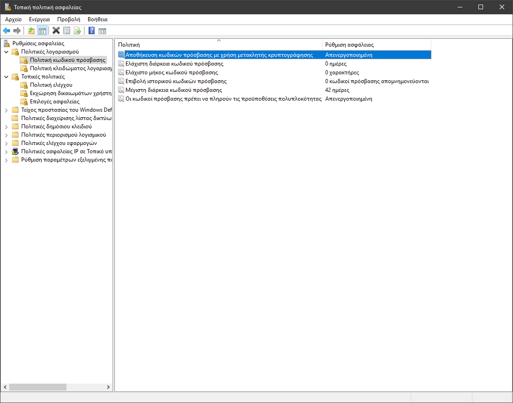
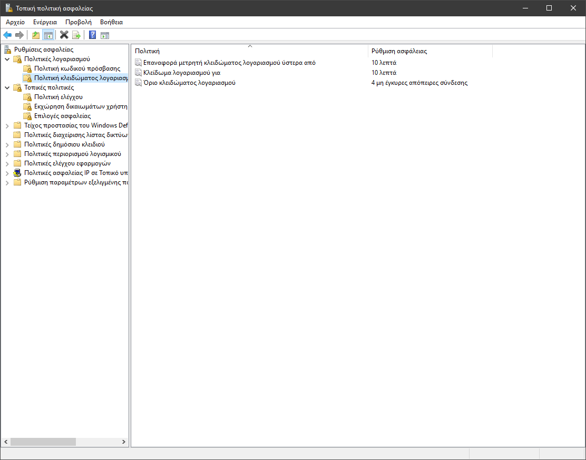

# Ασφάλεια Πληροφοριών & Συστημάτων: 1η Εργασία, 2019-2020

#### Τσιρπάνης Θεόδωρος (`dai19090`)

## Ερώτηση 1

Από αυτούς τους τέσσερεις, οι καταλληλότεροι κωδικοί πρόσβασης __συγκριτικά__ είναι ο δεύτερος και ο τρίτος, καθώς περιέχουν τουλάχιστον οκτώ τυχαίους χαρακτήρες.

Ο πρώτος δεν είναι ασφαλής διότι περιέχει τμήμα του ονόματος χρήστη (`chatzis`), ενώ ο τέταρτος είναι ακόμη χειρότερος επειδή αποτελείται από μια ελαφρώς αλλαγμένη εκδοχή της συνηθισμένης λέξης "password".

Παρότι οι δύο μεσαίοι κωδικοί πρόσβασης είναι καλύτεροι από τους άλλους δύο της εκφώνησης, ούτε αυτοί δεν είναι καλοί αρκετά. Το εργαλείο αξιολόγησης κωδικών πρόσβασης [zxcvbn της Dropbox][zxcvbn] δίνει ένα σκορ 2/4 και 3/4 αντίστοιχα για τον δεύτερο και τον τρίτο, ενώ εκτιμά ότι μια offline επίθεση εξαντλητικής αναζήτησης θα πάρει τρεις ώρες και μία μέρα αντίστοιχα με έναν αργό αλγόριθμο hash, ενώ με έναν γρήγορο θα πάρει λιγότερο από ένα δευτερόλεπτο.

## Ερώτηση 2

Οι ρυθμίσεις ασφάλειας των αντικειμένων AD συντίθενται από τον ιδιοκτήτη του αντικειμένου, το Discretionary Access Control List (DACL), και το System Access Control List (SACL).

## Ερώτηση 3

Όπως αναφέρεται στην παρουσίαση του δεύτερου εργαστηρίου, η εκχώρηση αδειών σε χρήστες γίνεται με έναν από τους τρεις τρόπους:

* Ο λογαριασμός χρήστη προστίθεται στο DACL του αντικειμένου. Η μέθοδος αυτή ονομάζεται explicit permission.

* Ένα γκρουπ όπου ανήκει ο χρήστης A προστίθεται στο DACL του αντικειμένου.

* Η άδεια κληρονομείται από τη DACL ενός γονικού αντικειμένου στην οποία έχει προστεθεί ο χρήστης ή το γκρουπ όπου ανήκει.

## Ερώτηση 4

1. [Δε θεωρείται καλή πρακτική η επιβολή αλλαγής κωδικού πρόσβασης ανά τακτά διαστήματα](https://www.ftc.gov/news-events/blogs/techftc/2016/03/time-rethink-mandatory-password-changes), καθώς υποχρεώνει τους χρήστες να θυμούνται έναν διαφορετικό κωδικό πρόσβασης κάθε φορά που πρέπει να τον αλλάξουν, αναγκάζοντάς τους να χρησιμοποιούν λιγότερο πολύπλοκους.

2. Η αποφυγή χρήσης του ίδιου κωδικού πρόσβασης είναι μια καλή επιλογή που χάνει το νόημά της όμως όταν ο κωδικός είναι πολύπλοκος αρκετά.

3. Είναι αμφίβολο ότι η επιβολή ελάχιστης διάρκειας κωδικού πρόσβασης βελτιώνει την ασφάλεια. Στη χειρότερη περίπτωση, μπορεί να παραβιαστεί ο κωδικός πρόσβασης ενός χρήστη και να μη μπορεί να τον αλλαχτεί επειδή είναι πολύ νωρίς.

4. Το κλείδωμα λογαριασμού μετά από αποτυχημένες προσπάθειες [μπορεί να οδηγήσει σε επιθέσεις άρνησης υπηρεσιών](https://www.cnbc.com/2019/04/10/toddler-locks-ipad-for-48-years-heres-how-to-unlock-it.html). Καλύτερη λύση είναι η χρήση υπολογιστικά απαιτητικών συναρτήσεων (key stretching) όπως η bcrypt για το αλάτισμα του κωδικού πρόσβασης. Σε μια offline επίθεση άλλωστε δεν έχει ισχύ κανένα κλείδωμα λογαριασμού.

5. Υποθέτοντας ότι οι κωδικοί πρόσβασης είναι πολύπλοκοι, το όριο λανθασμένων εισαγωγών μέχρι το κλείδωμα του λογαριασμού μπορεί να τεθεί σε ένα επίπεδο που δε θα καταστρατηγεί ούτε την εμπειρία του χρήστη ούτε την ασφάλεια του συστήματος.

6. Η επαναφορά του μετρητή κλειδώματος καλό θα ήταν να γίνεται με την επιτυχημένη εισαγωγή κωδικού πρόσβασης (αν και κάτι τέτοιο δε μπορεί να γίνει στα Windows). Ο χρήστης με το που συνδεθεί επιτυχώς θα μπορούσε να ενημερωθεί για τυχόν απόπειρες εισόδου στον λογαριασμό του αν δεν τις έκανε αυτός, για να πάρει μέτρα.

7. Εννοείται πως οι κωδικοί πρόσβασης θα πρέπει να τηρούν τις απαιτήσεις πολυπλοκότητας για να υπάρξει οποιαδήποτε έννοια ασφάλειας στο σύστημα.

## Ερώτηση 5

Οι τρόποι ανάκτησης κωδικού πρόσβασης είναι (έχοντας υποθέσει ότι έχει ανακτηθεί η σύνοψη του κωδικού με ένα εργαλείο όπως το fgdump):

### Επίθεση ωμής βίας

* __Πλεονεκτήματα:__ Είναι σίγουρο ότι θα πετύχει.
* __Μειονεκτήματα:__ Είναι υπολογιστικά ανέφικτο για πολύπλοκους κωδικούς πρόσβασης.

### Επίθεση λεξικού

* __Πλεονεκτήματα:__ Γρήγορη όταν ο κωδικός πρόσβασης είναι συνηθισμένος.
* __Μειονεκτήματα:__ Δεν είναι σίγουρο ότι θα πετύχει.

### Πίνακες ουράνιου τόξου

* __Πλεονεκτήματα:__ Γρήγορη ανάκτηση πολλών κωδικών με προ-επεξεργασία σταθερού χρόνου (ανεξάρτητου από το πλήθος των κωδικών προς ανάκτηση).
* __Μειονεκτήματα:__ Η προ-επεξεργασία είναι απαιτητική και σε χρόνο και σε μνήμη.

## Ερώτηση 6

Η Τοπική Πολιτική Ασφαλείας είναι χρήσιμη στην ρύθμιση και επιβολή μιας πολιτικής ασφαλείας για έναν μεμονωμένο υπολογιστή, σε αντίθεση με το Group Policy Editor. Επιτρέπει την ρύθμιση πολιτικών όπως την ισχύ και διάρκεια των κωδικών πρόσβασης.

## Ερώτηση 7

Ανοίγουμε την Τοπική Πολιτική Ασφαλείας στην σελίδα της πολιτικής κωδικού πρόσβασης όπως φαίνεται στην εικόνα:

Για κάθε πολιτική, θα κάνουμε τις εξής αλλαγές:

1. __Επιβολή ιστορικού κωδικών πρόσβασης:__ 5 κωδικοί πρόσβασης απομνημονεύονται (το μέγιστο είναι 24)
2. __Μέγιστη διάρκεια κωδικού πρόσβασης:__ 30 ημέρες
3. __Ελάχιστη διάρκεια κωδικού πρόσβασης:__ 2 ημέρες
4. __Ελάχιστο μήκος κωδικού πρόσβασης:__ 6 χαρακτήρες
5. __Οι κωδικοί πρόσβασης πρέπει να πληρούν τις προϋποθέσεις πολυπλοκότητας:__ Ενεργοποιημένη
6. _το ίδιο με το 5_

## Ερώτηση 8

Η επιβολή κλειδώματος λογαριασμού θα ήταν χρήσιμη σε περιπτώσεις όπως ένας φορητός υπολογιστής που υπάρχει κίνδυνος κλοπής του. Για να την επιβάλλουμε, ανοίγουμε την Τοπική Πολιτική Ασφαλείας, πηγαίνουμε στην πολιτική κλειδώματος λογαριασμού και αλλάζουμε τις ρυθμίσεις ώστε να εμφανίζονται όπως στην εικόνα:

## Ερώτηση 9

Τα συμβάντα των Windows καταγράφονται με την υποδομή Event Tracing for Windows (ETW) και εμφανίζονται με εργαλεία όπως το Event Viewer. Τα συμβάντα που θα καταγραφούν σε μια μηχανή μπορούν να ρυθμιστούν από την Τοπική Πολιτική Ασφαλείας, επιλέγοντας "Τοπικές Πολιτικές" και μετά "Πολιτική Ελέγχου".

## Ερώτηση 10

Στην Τοπική Πολιτική Ασφαλείας πηγαίνουμε στην πολιτική ελέγχου (όπως περιγράψαμε πριν) και για κάθε πολιτική που θέλουμε να εφαρμόσουμε κάνουμε τις εξής ρυθμίσεις:

1. __Έλεγχος συμβάντων σύνδεσης λογαριασμού:__ Αποτυχία
2. __Έλεγχος διαχείρισης των λογαριασμών:__ Επιτυχία, Αποτυχία
3. __Έλεγχος συμβάντων σύνδεσης:__ Επιτυχία

[zxcvbn]: https://lowe.github.io/tryzxcvbn
