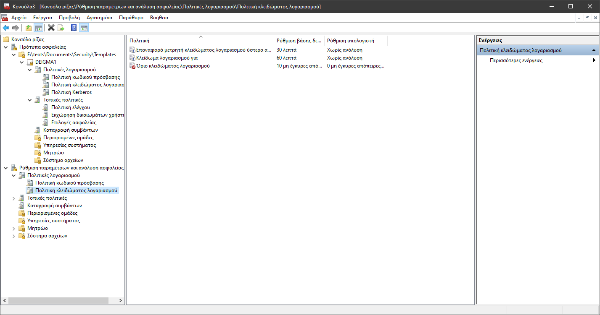

# Ασφάλεια Πληροφοριών & Συστημάτων: 4η Εργασία, 2019-2020

#### Τσιρπάνης Θεόδωρος (`dai19090`)

## Ερώτηση 1

1.
    Επειδή πολλές λεπτομέρειες για την εταιρία ACME παραλείφθηκαν από την εκφώνηση, χρησιμοποιήθηκε συχνά η επιλογή "Δεν ξέρω" στο ερωτηματολόγιο του MSAT.

    Η έκδοση 4.0.2.35 του MSAT δε μπορεί να εξάγει τις αναφορές σε αρχεία XML οπότε παρήχθη αντ' αυτού ένα αρχείο XPS.

2. Λόγω της άγνοιας μεγάλου τμήματος των πρακτικών ασφαλείας της _ACME_, δεν μπορούμε να βγάλουμε πολλά συμπεράσματα από την αναφορά. Παρ' όλα αυτά σημαντικές είναι οι προτάσεις υψηλής προτεραιότητας που προτείνονται όπως η κατάτμηση του δικτύου (segmentation) που απαντήθηκε πως δεν υπάρχει λόγω αμφιβολίας, και η υλοποίηση συστήματος αυθεντικοποίησης πολλών παραγόντων (MFA) για την απομακρυσμένη πρόσβαση στο εταιρικό δίκτυο.

## Ερώτηση 2

Η προτεινόμενη πολιτική κωδικών πρόσβασης για την _ACME_ είναι η κάτωθι:

Οι κωδικοί πρόσβασης θα πρέπει να:

* έχουν μήκος τουλάχιστον 8 χαρακτήρων
* έχουν τουλάχιστον έναν αλφαριθμητικό χαρακτήρα
* έχουν τουλάχιστον έναν χαρακτήρα ψηφίου
* έχουν τουλάχιστον έναν ειδικό χαρακτήρα (σημείο στίξης)
* αλλάζουν κάθε χρόνο
* μην ανήκουν στους 100.000 πιο συνηθισμένους κωδικούς πρόσβασης
* μην αποθηκεύονται σε μορφή καθαρού κειμένου αλλά "αλατισμένοι" και με μια ισχυρή συνάρτηση "τεντώματος κλειδιού" (key stretching). Οι παράμετροι δυσκολίας της συνάρτησης αυτής θα αναθεωρούνται κάθε 5 χρόνια σύμφωνα με τις βέλτιστες πρακτικές της βιομηχανίας, για να αντισταθμίσουν την άνοδο της υπολογιστικής ισχύος
* αποθηκεύονται κατά προτίμηση σε διαχειριστές κωδικών πρόσβασης (υποχρεωτικά για υψηλά ιστάμενα στελέχη). Σε μια τέτοια περίπτωση θα πρέπει να δημιουργούνται τυχαία από έναν κρυπτογραφικά ασφαλή αλγόριθμο.

Επιπλέον:
* Το σύστημα ασφαλείας θα κλειδώνει τους λογαριασμούς χρηστών που εισάγουν λανθασμένο κωδικό πρόσβασης μετά από έναν εύλογο αριθμό φορών.
* Το σύστημα ασφαλείας θα υποχρεώνει την χρήση MFA για την απομακρυσμένη πρόσβαση στο εταιρικό δίκτυο.

## Ερώτηση 3

_Η απάντηση της τρίτης ερώτησης ισοδυναμεί με την απάντηση της δεύτερης με τροποποιήσεις ήσσονος σημασίας και γι' αυτό δε θα επαναληφθεί._

## Ερώτηση 4

Έχοντας ολοκληρώσει τα βήματα, παρατίθενται στιγμιότυπα από την Κονσόλα Διαχείρισης της Microsoft:

