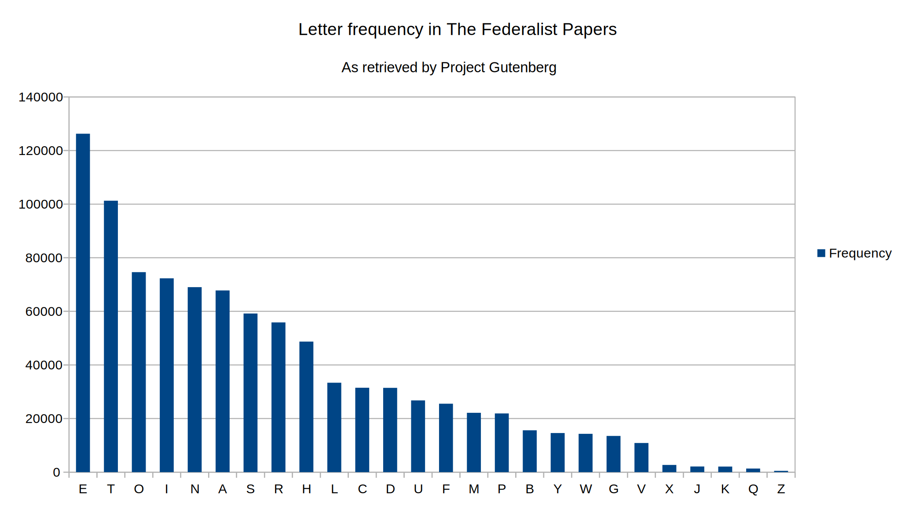

# Κρυπτογραφία ~ Άσκηση 1: Επίθεση μόνο Κρυπτοκειμένου

### Τσιρπάνης Θεόδωρος (`dai19090`)

## Ερώτημα 1

Το πρώτο ερώτημα της άσκησης αφορά την εύρεση της συχνότητας εμφάνισης κάθε γράμματος σε ένα αγγλικό έργο. Το έργο αυτό θα επιλεγόταν από τα διαθέσιμα κείμενα του [Project Gutenberg](https://www.gutenberg.org).

Για την υποβολή αυτήν, [επελέγη](http://www.gutenberg.org/ebooks/1404) η συλλογή των 85 [_"Federalist Papers"_](https://en.wikipedia.org/wiki/The_Federalist_Papers), που γραφτήκαν με σκοπό την παρότρυνση του κοινού στην κύρωση του συντάγματος των Ηνωμένων Πολιτειών.

Την καταμέτρηση των γραμμάτων στο κείμενο ανέλαβε το πρόγραμμα που επισυνάπτεται στο Παράρτημα Α. Κατόπιν, τα δεδομένα αντιγράφτηκαν χειροκίνητα σε ένα αρχείο CSV, το οποίο αποτέλεσε την πηγή δεδομένων για την δημιουργία του κάτωθι γραφήματος.



> __Σημείωση:__ τα κείμενα του Project Gutenberg περιέχουν τυποποιημένες δηλώσεις στην αρχή και στο τέλος τους που αφορούν θέματα όπως την άδεια χρήσης τους. Οι δηλώσεις αυτές _δεν_ αφαιρέθηκαν, αλλά επειδή το μέγεθός τους είναι αμελητέο μπροστά στο κυρίως κείμενο, και επειδή είναι κι' αυτές γραμμένες στα Αγγλικά, δεν επηρεάζουν ιδιαίτερα την κατανομή των γραμμάτων.

### Συμπεράσματα από την κατανομή των γραμμάτων

Συγκρίνοντας το γράφημα συχνότητας γραμμάτων των _Federalist Papers_ με αυτό του _The Room with the Little Door_, αυτό που μπορούμε να συμπεράνουμε εύκολα είναι ότι παρότι και τα δύο κείμενα περιέχουν τα γράμματα `E` και `T` με την μεγαλύτερη συχνότητα, μετά από αυτά, η σειρά των πιο συχνών γραμμάτων διαφέρει.

Για το παραπάνω συμπέρασμα, θα πρέπει να θυμηθούμε ότι το αρχείο κειμένου των _Federalist Papers_ έχει μέγεθος 1.1 MB, ενώ αυτό του _The Room with the Little Door_ είναι πολύ μικρότερο, με μέγεθος 194 KB. Φαίνεται πως σε μεγαλύτερα δείγματα αγγλικού κειμένου, η κατανομή είναι διαφορετική, και ίσως να σταθεροποιείται σε κάποιο σχήμα, όσο το μέγεθος του κειμένου αυξάνεται.

## Ερώτημα 2

Το δεύτερο ερώτημα της άσκησης ζητά την αποκρυπτογράφηση κρπυτοκειμένου, κρυπτογραφημένου με τον [κρυπτογραφικό αλγόριθμο μετάθεσης](https://en.wikipedia.org/wiki/Substitution_cipher), με άγνωστο κλειδι. Το δωθέν κρυπτοκείμενο είναι το εξής:

`HUOOPUOHH DT HOBQQUO`

### Ένας ντετερμινιστικός αλγόριθμος επίθεσης κρυπταλγορίθμου αντικατάστασης.

Όπως είδαμε προηγουμένως, παρότι η κατανομή της συχνότητας των γραμμάτων διατηρείται μετά την αντικατάστασή τους, είναι πολύ πτητική ακόμα και μεταξύ μεγάλων κειμένων, που σημαίνει ότι οι κατανομή που μετρήσαμε δεν αντιπροσωπεύει απαραίτητα ένα κείμενο των τριών λέξεων.

Για αυτόν τον λόγο, χρησιμοποιήθηκε ένας εναλλακτικός αλγόριθμος επίθεσης ο οποίος αντιμετωπίζει το κρυπτοκείμενο ως μια σειρά _λέξεων_, και όχι γραμμάτων. Ο αλγόριθμος είναι ντετερμινιστικός, που σημαίνει ότι δεν βασίζεται σε πιθανότητες. Η περιγραφή του σε ψευδοκώδικά δίνεται παρακάτω, και η υλοποίησή του στην Python δίνεται στο Παράρτημα Α.

Επίσης, ο αλγόριθμος χρειάζεται ένα λεξικό με λέξεις στην γλώσσα του καθαρού κειμένου που πρόκειται να αναζητήσει. Χρησιμοποιήθηκε ένα λεξικό με 370 χιλιάδες αγγλικές λέξεις που είναι [διαθέσιμο στο GitHub](https://github.com/dwyl/english-words/blob/master/words_alpha.txt).

#### Εισαγωγικές έννοιες

Ως _Κώδικα Πρώτης Περίστασης (First Incidence Code)_ ή _ΚΠΠ_ μίας ακολουθίας χαρακτήρων `C`, ορίζουμε την ακολουθία ψηφίων `U` ίσου μήκους με την `C`, τέτοια ώστε το `i`οστό στοιχείο της `U` είναι η θέση που το `i`οστό στοιχείο της `C` συναντάται για πρώτη φορά.

Υποθέτουμε ότι το πρώτο στοιχείο μίας ακολουθίας είναι το στοιχείο στην θέση 0.

Για παράδειγμα, ο ΚΠΠ των λέξεων `GOOD`, `COOL` είναι `0, 1, 1, 2`, ενώ ο ΚΠΠ της λέξης `FEDERALIST` είναι `0, 1, 2, 1, 3, 4, 5, 6, 7, 8`.

Είναι προφανές ότι ο ΚΠΠ μιας λέξης δεν αλλάζει όταν ο κάθε χαρακτήρας της αντικατασταθεί από έναν άλλον με μία αντιστοίχιση ένα-προς-ένα· κάτι που συμβαίνει στην κρυπτογράφιση με αντικατάσταση.

---

Έχοντας κάνει την εισαγωγή, αυτός είναι ο αλγόριθμος:

> __Σημείωση:__ Το κρυπτοκείμενο είναι μια λίστα λέξεων, όπως και το καθαρό κείμενο. Το κλειδί είναι ένας πίνακας κλειδιων-τιμών που αντιστοιχίζει κάθε χαρακτήρα στο καθαρό κείμενο σε έναν χαρακτήρα στο κρυπτοκείμενο.

```
Αλγόριθμος Επίθεση(Λεξικό, Κρυπτοκείμενο)
Αρχή

  Αλγόριθμος ΘαΜπορούσεΝαΕίναι(ΠιθανόΚλειδί, ΠιθανόΚαθαρόΚείμενο, Κρυπτοκείμενο)
  Αρχή
    // Ο ψευδοκώδικας της συνάρτησης ΚΠΠ παραλείπεται
    Αν ΚΠΠ(ΠιθανόΚαθαρόΚείμενο) != ΚΠΠ(Κρυπτοκείμενο) τότε
      Επίστρεψε Ψευδές
    Για κάθε ι από 0 έως Μήκος(ΠιθανόΚαθαρόΚείμενο) - 1
      Αν το ΠιθανόΚαθαρόΚείμενο[ι] υπάρχει ως κλειδί στο ΠιθανόΚλειδί τότε
        Αν ΠιθανόΚλειδί[ΠιθανόΚαθαρόΚείμενο[ι]] != Κρυπτοκείμενο[ι] τότε
          Επίστρεψε Ψευδές
      Αλλιώς
        Αν το Κρυπτοκείμενο[ι] υπάρχει ως τιμή στο ΠιθανόΚλειδί τότε
          Επίστρεωε Ψευδές
    Επίστρεψε Αληθές
  Τέλος

  Αλγόριθμος loop(Κλειδί, ΠιθανόΚαθαρόΚείμενο: λίστα συμβολοσειρών, ι: ακέραιος)
  Αρχή
    Αν ι = Μήκος(Κρυπτοκείμενο) τότε
      Εμφάνισε ΠιθανόΚαθαρόΚείμενο
    Αλλιώς
      Για κάθε ΠιθανήΛέξη στο Λεξικό
        Αν ΘαΜπορούσεΝαΕίναι(Κλειδι, ΠιθανήΛέξη, Κρυπτοκείμενο[ι]) τότε
          ΝέοΠιθανόΚλειδί := Κλειδί
          Για κ από 0 έως Μήκος(Κρυπτοκείμενο[ι]) - 1
            Πρόσθεσε στο ΝέοΚλειδί το ζεύγος κλειδιού-τιμής (ΠιθανήΛέξη[κ], Κρυπτοκείμενο[ι][κ])
          loop(ΝέοΠιθανόΚλειδί, ΠιθανόΚαθαρόΚείμενο + ΠιθανήΛέξη, ι + 1)
  Τέλος
  loop([], [], 0)
Τέλος
```

Ο αλγόριθμος ακολουθεί την τεχνική της οπισθοδρόμησης (backtracking). Στην ουσία, για κάθε λέξη του κρυπτοκειμένου, χτίζει σταδιακά ένα πιθανό κλειδί, παίρνοντας όλες τις πιθανές αγγλικές λέξεις, και ελέγχει αν ταιριάζουν με την λέξη του κρυπτοκειμένου που εξετάζει (δηλαδή αν έχουν τον ίδιο ΚΠΠ, και αν το μέχρι τώρα κλειδί θα μπορούσε να τις αποκρυπτογραφήσει).

---

Ας δούμε λοιπόν το παράδειγμά μας. Ο ΚΠΠ της λέξης `HUOOPUOHH` είναι `0, 1, 2, 2, 3, 1, 2, 0, 0`. Προς μεγάλη μας τύχη, η μόνη λέξη του λεξικού με αυτόν τον ΚΠΠ είναι η λέξη `SLEEPLESS`. Άρα το κλειδί αντιστοιχίζει το S με το H, το U με το L, και ούτω καθ' εξής.

Ο ΚΠΠ της λέξης `DT` είναι `0, 1`. Υπάρχουν πολλές λέξεις με αυτόν τον ΚΠΠ. Επιπλέον, επειδή οι δύο αυτοί χαρακτήρες δεν υπήρχαν στην προηγούμενη λέξη, δεν έχουμε ιδέα ποιοι θα μπορούσαν να είναι. Όμως, έχουμε κάποια ιδέα ποιοι _δεν_ θα μπορούσαν να είναι. Για παράδειγμα, σίγουρα ούτε το `D`, ούτε το `T` δεν θα είναι `S`, `L`, `E`, ή `P`. Οπότε, λέξεις όπως `HE`, `WE` και άλλες αποκλείονται, και ο αλγόριθμός μας δεν θα τις κοιτάξει καθόλου.

Συνεχίζοντας έτσι, ο αλγόριθμος βρήκε πιθανά καθαρά κείμενα όπως τα παρακάτω:

* `SLEEPLESS OD SEATTLE`
* `SLEEPLESS CO SEATTLE`
* `SLEEPLESS OC SEATTLE`
* `SLEEPLESS HI SEATTLE`
* `SLEEPLESS HO SEATTLE`
* `SLEEPLESS OH SEATTLE`
* `SLEEPLESS NR SEATTLE`
* `SLEEPLESS RN SEATTLE`
* `SLEEPLESS IR SEATTLE`
* `SLEEPLESS OR SEATTLE`
* `SLEEPLESS RO SEATTLE`
* `SLEEPLESS IN SEATTLE`
* `SLEEPLESS NI SEATTLE`
* `SLEEPLESS NO SEATTLE`
* `SLEEPLESS ON SEATTLE`
* `SLEEPLESS IO SEATTLE`

> __Σημείωση:__ Αυτά είναι τα πιθανά κρυπτοκείμενα που βρήκε το πρόγραμμα του Παραρτήματος 1. Είναι ταξινομημένα ώστε αυτό με τα περισσότερα συχνά γράμματα να βρίσκεται στο τέλος (ώστε ο χρήστης να μην χρειάζεται να κυλάει με το ποντίκι στην αρχή για να το βρει). Επίσης, από προεπιλογή, τα 75 πιο πιθανά καθαρά κείμενα θα εμφανιστούν. Μπορούν να εμφανιστούν όλα, προσθέτοντας ένα κενό στην είσοδο πριν το κρυπτοκείμενο.

Θεωρητικά, _οποιαδήποτε_ από τις παραπάνω προτάσεις __θα μπορούσε__ να είναι το καθαρό κείμενο, μιας και δεν ξέρουμε πολλά πράγματα για την λέξη στην μέση. Ένας γνώστης του κινηματογράφου όμως, θα καταλάβει αμέσως ότι πρόκειται για την ταινία του Τομ Χανκς, [_Sleepless in Seattle_](https://en.wikipedia.org/wiki/Sleepless_in_Seattle).

---

Tο δεύτερο κρυπτοκείμενο είναι το `FOOQ FO BQ QSO BDRPMRQ`. Ξέρουμε ότι είναι κρυπτογραφημένο με το ίδιο κλειδί που χρησιμοποιήθηκε στο πρώτο κρυπτοκείμενο. Μπορούμε να το πούμε αυτό στο πρόγραμμά μας, βάζοντάς το να αποκρυπτογραφήσει το `HUOOPUOHH DT HOBQQUO FOOQ FO BQ QSO BDRPMRQ`, που αποτελείται από τα δύο κρυπτοκείμενα ενωμένα.

Μία εκ των πιθανών προτάσεων -και η μόνη που βγάζει νόημα- είναι η `SLEEPLESS IN SEATTLE MEET ME AT THE AIRPORT`, που σημαίνει ότι το δεύτερο καθαρό κείμενο είναι η πρόταση

`MEET ME AT THE AIRPORT`

